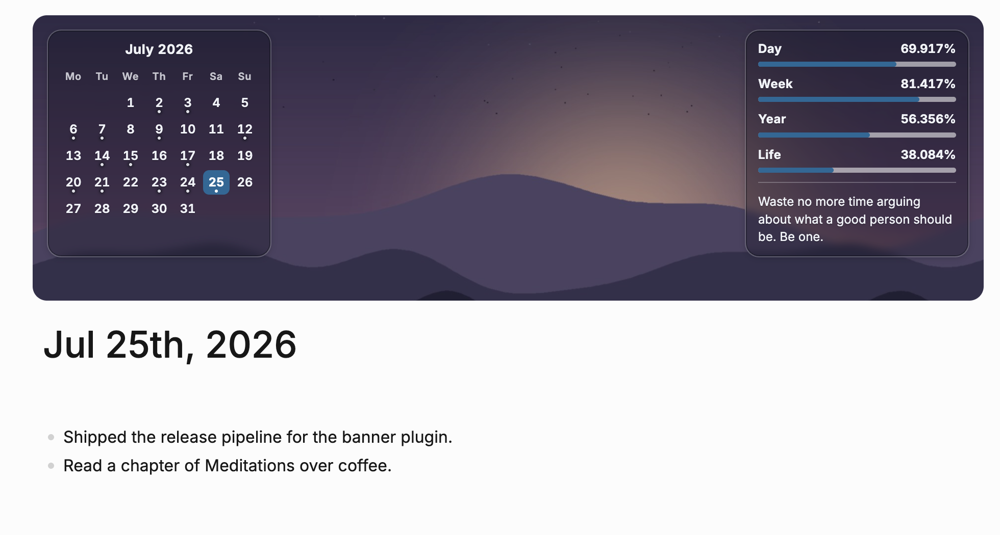

# DB Banner

[English](README.md)

一个仅适用于 **Logseq DB graph** 的横幅插件。在日志页面内容区顶部渲染一条横幅：背景是本机壁纸，之上左右两端各放一张半透明毛玻璃卡片——左端是当月日历，右端自上而下是当天／本周／当年／人生四条进度条，底部是一言。



## 功能

- **仅日志页面**：横幅只出现在日志视图——日志主页（多天滚动流）与单个日志页面。普通页面、All pages、设置、图谱视角、白板、插件页面都不会渲染横幅；离开日志视图时横幅会被移除，返回时重新渲染。
- **本机壁纸**：支持本机绝对路径、`https://` 链接，或相对于图谱 `assets` 目录的路径。可设置填充方式与位置；图片缺失或无法读取时回退为渐变背景，组件仍然可读。
- **两张卡片的版式**：日历卡贴横幅左端、进度卡贴右端（内缩量就是横幅自身的 14px 内边距，两张卡都不会紧贴边框），两张卡片各自只占内容所需的宽度（不再拉满整条横幅，被推开的只是间距，卡片本身不变宽），因此卡片周围、尤其是两者之间露出成片壁纸——实测 932px 内容列上，日历卡占 46–266px、进度卡占 700–950px，中间空出 434px 壁纸。只剩一张卡片时（关掉日历，或进度卡上的组件全部关闭）它停在左端；**两张卡片等高**——整行的高度取内容较高的那张，另一张拉伸对齐，实测两者高度差为 0px，不是"看起来差不多"。进度卡里的内容按这个高度上下均分，因此隐藏一言时卡内也不会在底部留下一块空白。卡片共用一套字号、间距、圆角与强调色（强调色同时用于"今天"和进度条填充）。遮罩很淡（`rgba(12, 15, 22, 0.3)`）＋ `blur(4px)` 毛玻璃，壁纸依然透过卡片看得清；卡片同时靠**边缘**成形——一道墨色细线，配上一圈 1px 深色内描边与一层柔和外发光，无论壁纸明暗都能看清卡片轮廓。文字**不再使用字形光晕**（此前是每个字周围叠四层 `text-shadow` 的环形光晕，看上去发光、读起来费劲），改为遮罩本身承担可读性，再加一道朝下的柔和投影（`0 1px 1px`，24%）。**卡片配色不跟随宿主主题**：横幅是压在图片上的一层表面，不是页面的一部分。浅色主题下 `--ls-primary-background-color` 是白色，用它调出来的遮罩几乎压不暗深色壁纸，而主题的深色文字又正好落在深色图片上——根本看不清。因此遮罩与文字都是固定值（深色玻璃＋浅色文字），无论壁纸明暗、主题深浅都可读；只有强调色仍取自主题变量 `--lx-accent-11`。
- **时间进度组件**：当天、本周、当年、人生四条进度条，各自显示标签、进度条与**三位小数**的百分比（如 `41.286%`）。不再显示"剩余多少小时／天／年"。百分比使用等宽数字（tabular figures）并占固定宽度，末位每约 0.86 秒变化一次也不会让整行左右抖动。每秒自动刷新，无需手动刷新页面。
- **人生进度**：由出生日期与预期寿命（默认 85 年）计算。出生日期在未来时显示 0%，寿命已超出时显示 100%。
- **当月日历**：今天高亮；已经写过内容的日期带一个小圆点；点击任意日期都会跳转到该天的日志页面——无论那天已有内容、页面存在但是空的、还是页面根本不存在。首列跟随 `Week starts on` 设置。写入一个块之后，圆点约 1 秒内出现（监听 `logseq.DB.onChanged`）。
- **一言**：显示在进度卡底部（与进度条同属"数字读数"，放在同一张卡里比单独占一块更连贯），字号 12px、正体、不再是半透明斜体，读起来是一句话而不是一行注脚。语录来源同时支持标签的两种佩戴方式：**块本身**携带该标签（任意层级），以及携带该标签的**页面**的顶层块。因此 Logseq 内置的 `Quote` 节点类型可以直接当作来源——把 `Quote source tag` 填成 `Quote` 即可，不需要迁移数据。（内置 `Quote` 是类 `:logseq.class/Quote-block`，从旧版文件图谱导入时，原先写成 `#quote` 的块会被打上这个标签；它只挂在块上，不挂在页面上，所以只按"页面标签"查是找不到的。）**每次进入日记视图都会换一条**：进页面（首次挂载、以及从任意页面切回日记页）时随机挑选，之后停在那一条不动——横幅每秒重绘、语录缓存到期重新查询都不会让它跳字；候选多于一条时不会紧接着重复上一条。日记页之间互相跳转算两次进入，各自换一条。候选只有一条时就一直显示那一条。标签不存在、来源为空或查询失败时，组件安静地不显示，横幅其余部分照常工作。过长的语录会被截断并限制在 3 行内，不会撑高或撑宽横幅。
- 切换页面后横幅自动重新挂载。

日历标记与语录都需要查询图谱，但横幅每秒重绘一次：这两项数据按键（当前月份 / 标签名）缓存，并在图谱写入（`logseq.DB.onChanged`，300ms 合并、最长 1.5s 强制刷新）、路由切换、设置变更或缓存超时（日历 60 秒、语录 5 分钟）时才重新查询，不会每秒打一次数据库。缓存失效时旧值继续显示到新值到达，所以刷新过程中组件不会先消失再出现。

横幅高度默认 `280px`，够放下一个不拥挤的月历，同时留出成片的壁纸。它是**最小高度**：填得太小时横幅会长到内容所需的高度，而不是裁切或重叠。默认布局下两张卡片约占横幅面积的 40%（等高之前为 38%，更早的满宽版式为 88%）。

## 仅支持 DB graph

`package.json` 的 `logseq.unsupportedGraphType` 为 `"file"`，Logseq 不会在 file graph 上启用本插件。启动时还会再次调用 `logseq.App.checkCurrentIsDbGraph()`，若当前不是 DB graph 则提示并退出。

## 设置项

在 `Settings → Plugin Settings → DB Banner` 中配置：

| 设置 | 默认值 | 说明 |
| --- | --- | --- |
| Wallpaper source / 壁纸来源 | 空 | 本机绝对路径（如 `/Users/me/Pictures/wall.jpg`，Windows 如 `D:\桌面\wall.jpg`）、`https://` 链接、`data:` URI，或图谱相对路径（如 `../assets/wall.jpg`）。留空、`false`、`none`、`off` 均表示不使用壁纸。 |
| Wallpaper fit / 填充方式 | `cover` | `cover`、`contain` 或 `tile`。 |
| Wallpaper position / 图片位置 | `50% 50%` | CSS `background-position`，如 `center top`。 |
| Banner height / 横幅高度 | `280px` | CSS 长度，如 `280px`、`32vh`。这是最小高度：值太小时横幅会自行长高，不裁切。 |
| Birth date / 出生日期 | 空 | `YYYY-MM-DD`。未填写时人生进度显示 `--%`。 |
| Lifespan in years / 预期寿命（年） | `85` | 人生进度条的分母。 |
| Week starts on / 一周起始日 | `monday` | `monday`、`sunday` 或 `saturday`，同时决定周进度的分界与日历的首列。 |
| Quote source tag / 语录来源标签 | `quotes` | 语录来源标签名。可以写 `quotes`、`#quotes` 或 `[[Quotes]]`（大小写不敏感）；填 `Quote` 则使用 Logseq 内置的 `Quote` 节点类型。每次进入日记视图换一条。留空表示关闭语录组件。 |
| Show day / week / year / life / calendar / quote widget | 全部开启 | 分别控制六个组件是否显示。 |

组件开关的设置键在 phase 2 从 `show<Id>Progress` 改名为 `show<Id>Widget`（"进度"已经不适用于日历和语录）。插件首次启动时会把旧键的值搬到新键，并写入 `settingsVersion: 2` 作为一次性标记，之后旧键不再参与判断——所以既有配置不会被重置，之后改动新键也不会被旧值覆盖回去。旧键会保留在设置文件里，以便回退到旧版本。

不合法的值会退回默认值，而不是把无效内容写进 CSS。`~` 开头的路径无法在插件沙箱中展开，会被视为未设置——请填写完整绝对路径。

## 壁纸是怎么读到本机文件的

Logseq 桌面端把 `assets://` 注册为特权协议（`standard`、`secure`、`bypassCSP`、`supportFetchAPI`、`streaming`），其 Electron 处理函数会剥掉 `assets://` 前缀、`decodeURIComponent` 之后按绝对路径直接读文件。所以：

- POSIX 绝对路径 → 插件转成 `assets:///绝对/路径`（逐段 percent-encode，空格与 `#` 都安全）；
- Windows 路径 → 插件转成 `assets:///D/logseq__colon/后面的/路径`。`assets:` 是 *standard* 协议，Chromium 会把前导斜杠折进 URL 的 host，盘符因此落在 host 上，而 host 放不下冒号的任何形式：`%3A` 会让整个 URL 非法，字面 `:` 会被当成端口分隔符、盘符直接丢失。`logseq__colon` 是 Logseq 自己用的替身，处理函数读文件前会把它还原成 `D:/`；
- 图谱相对路径 → 交给 `logseq.Assets.makeUrl()`，由 Logseq 解析到当前 DB graph 的 `assets` 目录。

`file://` 不在特权协议列表中，渲染进程运行在 `lsp://logseq.com` 源上，因此 `file://` 子资源会被拦截——`assets://` 才是可行路径。

## 横幅怎么判断"当前是日志视图"，又挂在哪里

判断依据来自宿主状态，不是 URL 字符串：

- 路由名 `logseq.App.getStateFromStore(['route-match', 'data', 'name'])`：`home`、`allJournals` 是日志流，`page` 是 `/page/:name`。注意必须按路径取值——整个 `route-match` 无法跨插件桥序列化，请求它只会超时。
- 当前页面 `logseq.Editor.getCurrentPage()`：Logseq 2.0.1 的 DB graph 页面实体上既没有 `journal?` 也没有 `type`（与类型声明不符），只有日志页面带 `journalDay`（形如 `20260725`）。

判断逻辑集中在 `src/journal.ts` 的纯函数 `shouldMountBanner` 中，可脱离宿主单测。

挂载点是 `#main-content-container .cp__sidebar-main-content`，而不是 `#main-content-container` 本身：后者是 `display: flex; flex-direction: row` 的滚动容器，唯一的 flex 子元素就是内容列（`flex: 1 1 0%`），把横幅插进去会让它变成内容列的兄弟 flex item，把内容列压成零宽度。（右侧栏 `#right-sidebar` 在 `#app-container` 下，是该滚动容器的兄弟节点，从外部挤窄内容列。）注入的 CSS 全部以 `#lsdb-banner` 开头，不改宿主容器样式。

## 从源码安装

要求 Node.js `^20.19.0 || ^22.13.0 || >=24.0.0`（即 20.19.0 起的 20.x、22.13.0 起的 22.x，或 24 以上）。这条范围与 `package.json` 的 `engines.node` 一致，来自开发依赖 `jsdom` 的要求；版本不符时 `npm ci` 会直接报版本错误。

```bash
npm ci
npm run check   # 测试 + 类型检查 + 构建到 dist/
```

1. 在 Logseq 中开启 Developer Mode。
2. 打开 `Plugins`，选择 `Load unpacked plugin`。
3. 选择本仓库根目录（包含 `package.json` 与构建产物 `dist/`）。

改动源码后执行 `npm run build`，再在 Logseq 中 Reload 插件。持续构建用 `npm run dev`。

## 新增组件

`src/widgets.ts` 里的 `widgetDefinitions` 是唯一的组件清单。追加一个描述符即可，`banner.ts` 不需要改：

- `build(context, data)` 是纯函数，返回 `src/view.ts` 里的 `WidgetNode` 树（普通数据，因此可以直接单测）；返回 `null` 表示"无内容"，该组件就不渲染。
- 需要读图谱的组件再实现 `request(context)`，返回 `{ key, ttlMs, load(host) }`：运行时按 `key` 与 `ttlMs` 缓存，渲染时同步读缓存，加载在后台进行。
- 需要点击行为时，在节点上挂 `action`（如 `{ kind: 'openJournalDay', day }`）；渲染层用事件委托统一分发，组件自己不加监听器。
- `group` 决定组件落在哪张卡片上：`'calendar'` 或 `'panel'`（默认）。渲染层按组件 id 与卡片 id 做 keyed 复用，组件出现或消失都不会重建邻居的 DOM。
- 可见性设置项按 `show<Id>Widget` 自动生成。

## 许可

[MIT](LICENSE)
